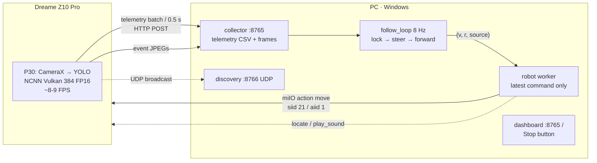
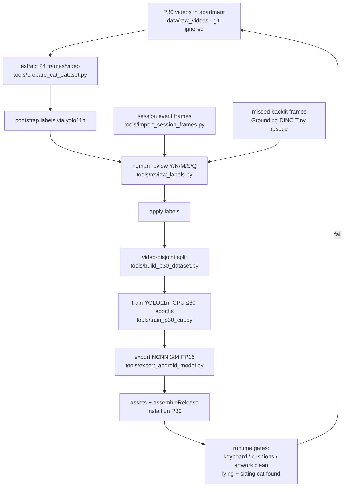
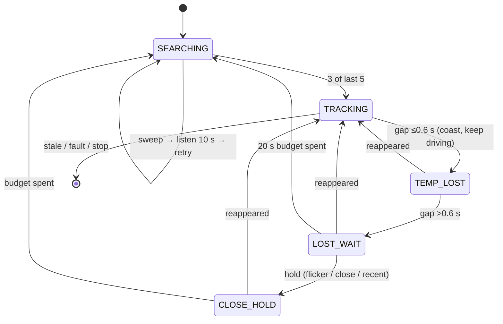

# Cat Stalker

An experimental pet robotics project: a **Dreame Z10 Pro** robot vacuum
carries a phone camera, detects the user's real cat with on-device YOLO,
keeps it centered in frame, and slowly follows it — with a human and a
kill switch always nearby.

Status: working prototype under active tuning (October 2026). The robot
finds, centers, and approaches a calm sitting cat; a walking cat still
outruns its turn rate. Not a product; not safe around stairs, cables, or
other pets.

- English (this file) · [Русский](README_RU.md)


## Contents

- [The idea](#the-idea)
- [Hardware](#hardware)
- [Operating modes](#operating-modes)
- [System architecture](#system-architecture)
- [Phone app & detector](#phone-app--detector)
- [Training pipeline](#training-pipeline)
- [Running a session](#running-a-session)
- [Follow logic](#follow-logic)
- [Dreame control](#dreame-control)
- [Safety](#safety)
- [Repository & documents](#repository--documents)
- [Git policy](#git-policy)

Agent notes with exact behavior constants and dated findings:
[AGENTS.md](AGENTS.md) — read it before changing motion code.

## The idea

A vacuum already knows how to drive; a phone already knows how to see.
Cat Stalker bolts them together: the phone watches, the PC thinks, the
robot moves. Detection runs fully on-device (no cloud); the PC only
receives telemetry rows and occasional event JPEGs, decides motion at
8 Hz, and sends the single latest `(velocity, rotation)` command to the
robot. Stale commands are never queued. When vision is uncertain, the
robot stops — it never drives blind.

## Hardware

| Part | Details |
|---|---|
| Robot | Dreame Z10 Pro, `dreame.vacuum.p2028`, fw `4.1.8_1156`, LAN `192.168.1.124` |
| Camera | Huawei P30 on the robot, **landscape only**. Portrait mount is unverified: the steering-axis mapping was validated for landscape (a portrait-mounted phone once made the robot steer by the cat's *height* — see `AGENTS.md`) |
| Reference cam | USB webcam on PC (prototype era) |
| Manual override | Xbox controller (prototype script) |

## Operating modes

| Mode | Code | Sees with | Thinks on | Drives |
|---|---|---|---|---|
| Prototype (reference) | `cat_stalker.py` (Windows) | USB webcam, COCO YOLO + ByteTrack | same PC | Dreame via miIO, Xbox override |
| Autonomous session | `android/` + `session/` | P30, custom `p30_cat_v5` NCNN | P30 detects, PC decides | Dreame via miIO, no Xbox |

The prototype proved the motion math (V1.5 centered accurately, V1.6
added approach). The session stack ports that math to the phone stream
and adds zero-touch operation: launch both ends and walk away; the
robot reports via speaker sounds.

## System architecture



Independent loops and their rates:

| Loop | Rate | Job |
|---|---|---|
| Phone `ImageAnalysis` | ~8–9 FPS, `KEEP_ONLY_LATEST` | detect, buffer ≤2000 rows + ~100 MB JPEGs, upload |
| Collector HTTP | on arrival | persist `phone_telemetry.csv`, `frames/`, heartbeats |
| `follow_loop` | 8 Hz | target lock, steering, forward, search episodes |
| Robot worker | 8 Hz moving / 1.5 Hz idle keepalive | send latest `move`, measure RTT, count failures |
| Main watchdog | 1 Hz | duration, disk, phone silence, fault interlock, `STATUS.md` |

Details: [session/README.md](session/README.md),
[android/README.md](android/README.md).

## Phone app & detector

Two runtimes, switchable in-app: **NCNN Vulkan 384 FP16 + native YUV**
(active, ~100–130 ms, ~8–9 FPS sustained) and **TFLite CPU 480**
(correctness baseline). The TFLite GPU delegate does not load on the
P30's Mali/Android 10 stack. Native YUV feeds the sensor buffer
straight to NCNN (bilinear); the bitmap path exists for capture and
fallback.

P30 operating points measured on-device (full table in
[android/README.md](android/README.md)): 320/352 rejected (miss the cat
at ~3.5 m), 480 FP16 rejected (~6 FPS, still unreliable at 4 m+),
**384 FP16 accepted** — best recall/FPS trade-off.

Detector lineage (full story with metrics:
[data/p30_cat_training_results.md](data/p30_cat_training_results.md)):

| Model | Val P / R | Fate |
|---|---|---|
| COCO `yolo11n` | 0.20 / 0.35 | baseline; fires on pillow print, keyboard, artwork |
| v1 (apartment frames) | 0.959 / 0.959 | rejected on P30: gray-pillow/keyboard FP storm |
| v2 (+hard negatives) | 0.920 / 0.934 | rejected: missed the real cat (traced to nearest-neighbor native resize, fixed to bilinear) |
| v3 (balanced negatives) | 0.932 / 0.918 | rejected: keyboard FP at 0.6–0.8 |
| v4 (+exact failure scenes ×4) | 0.951 / 0.898 | superseded: recall dipped |
| **v5 (+18 DINO-rescued backlit frames)** | **0.937 / 0.939** | **live on the phone**: gates pass (picture/cushions/keyboard clean, lying cat OK) |

Known residual: v5 still fires on the **printed cat at close
range / low angle**. That session is marked `NOT_FOR_TRAINING` (hard
negatives only) — check marker files before any retraining.

## Training pipeline



Rules that matter (full workflow:
[data/DATASET_WORKFLOW.md](data/DATASET_WORKFLOW.md)):

- Review with `tools/review_labels.py --dir <name>` (RU keyboard layout
  accepted). Keep tight boxes, delete prints/reflections, keep
  cat-free frames as negatives.
- **Split by source video, never by frame** — otherwise validation lies.
- Retrain commands:
  ```powershell
  .\.venv\Scripts\python.exe tools\build_p30_dataset.py
  .\.venv\Scripts\python.exe tools\train_p30_cat.py
  ```
- Threshold-only fixes are rejected: hard true and false cases overlap
  at conf 0.3–0.5. Fix data, not thresholds.
- `tools/test_follow_hold.py` verifies follow-loop hold/sweep behavior
  without a robot.

## Running a session

Prerequisites: `.venv` with
`pip install "git+https://github.com/rytilahti/python-miio.git"`,
`DREAME_TOKEN` in env (never in code), phone + PC on the same Wi-Fi,
Windows Firewall open for TCP `:8765` and UDP `:8766`.

```powershell
python -m session.auto_session --mode follow --duration-min 5
# --mode observe | patrol | follow ; without token everything is observe-only
```

Zero-touch flow: start the PC command (it prints `phone_url`), mount
the phone **landscape** low at the front (must not cover the lidar
turret or cliff sensors), robot >1 m from walls/dock, launch the app —
it discovers the collector and streams by itself. Watch
`http://<pc-ip>:8765/` or `sessions/<stamp>/STATUS.md`.

Speaker vocabulary: `locate` = come here, `play_sound` ×1 = done,
×2 = error. Every run writes `sessions/<stamp>/`:
`phone_telemetry.csv`, `robot_telemetry.csv`, `robot_status.csv`,
`frames/`, `events.jsonl`, `STATUS.md`; `session/analyze.py` adds
`ANALYSIS.md`.

Interception: phone Stop button, PC Ctrl+C (safe stop `(0,0)` +
`stop_clean`), dashboard Stop, or lift the robot. Watchdogs: phone
silence 15 s hold / 60 s stop, robot failures ≥5 stop, disk <1 GB stop,
duration end. Full policy: [session/README.md](session/README.md).

## Follow logic

Lock: 3-of-5 frames to acquire (consecutive counting never fires on the
flickering phone detector) → `TRACKING` with EMA smoothing
(position 0.60 / size 0.25) → `TEMP_LOST` (≤0.6 s coast on the frozen
target) → `LOST_WAIT` (hold: 1.5 s minimum, longer if seen <6 s ago or
adjacent) → one-direction sweep episodes (20 s budget, exit side first,
otherwise continue for 360°+ coverage) → giveup + listen 10 s → retry.
Stale frames (>0.5 s) and device faults always stop; a fault also
resets the lock so a carried robot re-acquires fresh.



Current tuning (2026-10-06, all in `session/follow.py` /
`session/auto_session.py`):

| Parameter | Value | Why |
|---|---|---|
| Steering P+D, deadband | KP 24 / KD 3, ±0.05–0.10 | ported from prototype V1.5 |
| Rotation min / max | 10 / 22 | <10 sits in a firmware deadzone (75 s frozen offset proven); 22 is the prototype value, still loses to a walking cat |
| Cruise max | 40 | 2× twice per operator; turn-fraction scaling keeps turns slow |
| Forward area start/stop | 0.095 / 0.135 | UNCALIBRATED for the low camera |
| Forward offset gate | 0.65 | 0.13 blocked all driving (cat lived at 0.58) |
| Forward conf start/stop | 0.32 / 0.25 | hysteresis against close-range dips |
| Slew per 8 Hz cycle | 5 rot / 8 vel | ~0.5 s full swing; stops/holds direct |
| Speed governor | fps/8, floor 0.4 | never outrun fresh frames |

## Dreame control

| Action | siid / aiid | Use |
|---|---|---|
| `move` | 21 / 1 | piid 1 = rotation, piid 2 = velocity |
| `locate` | 7 / 1 | attention signal |
| `play_sound` | 7 / 2 | ×1 done, ×2 error |
| `start_clean` / `stop_clean` | 4 / 1, 2 | teardown |
| `home` | 3 / 1 | |

Manual mode always spins the vacuum motor (`set_fan_speed(0)` → Quiet).
The Z10 Pro sleeps Wi-Fi aggressively in idle (multi-second buffered
pings), so the worker sends `move(0,0)` keepalive — 1.5 Hz idle, 8 Hz
moving. A read-only heartbeat does **not** keep it awake.

## Safety

- Small room, no floor cables, human present, dustbin empty.
- Speeds are a starting point, not a limit review — raise only after a
  calm sitting-cat run is stable; `STOP_AREA` guards the approach, watch
  for overshoot after every speed bump.
- The stack cannot see drop-offs ahead; the fault interlock reacts
  after the fact. Never near stairs or table edges (one cliff event
  already caught in telemetry).
- No autonomous reverse. `DREAME_TOKEN` from env only.

## Repository & documents

| Path | Contents |
|---|---|
| `cat_stalker.py` | Windows prototype (reference — Xbox + webcam) |
| `android/` | P30 app (Kotlin + CameraX, NCNN Vulkan native YUV) — [android/README.md](android/README.md) |
| `session/` | PC orchestrator (collector, follow, robot link, discovery) — [session/README.md](session/README.md) |
| `sessions/` | recorded runs (git-ignored) |
| `tools/` | dataset / training / review / test scripts |
| `data/` | frames, labels, training results (bulk git-ignored) — [data/DATASET_WORKFLOW.md](data/DATASET_WORKFLOW.md), [data/p30_cat_training_results.md](data/p30_cat_training_results.md) |
| `AGENTS.md` | agent notes: exact constants, dated findings |

## Git policy

Nothing is committed yet. `.gitignore` already excludes the bulk:
videos, extracted/review/training images (`data/**/*.jpg|mp4|…`),
weights (`*.pt`, `*.tflite`), NCNN exports except the live v5 asset
hardcoded in `ncnn_detector.cpp`, Android build dirs (`.cxx/`,
`app/build/`, `.gradle/`), `sessions/`, `runs/`, secrets. A first
commit takes ~180 files: code, docs, labels, manifests, configs — zero
photos. Raw videos live only on this PC; back them up outside git.
