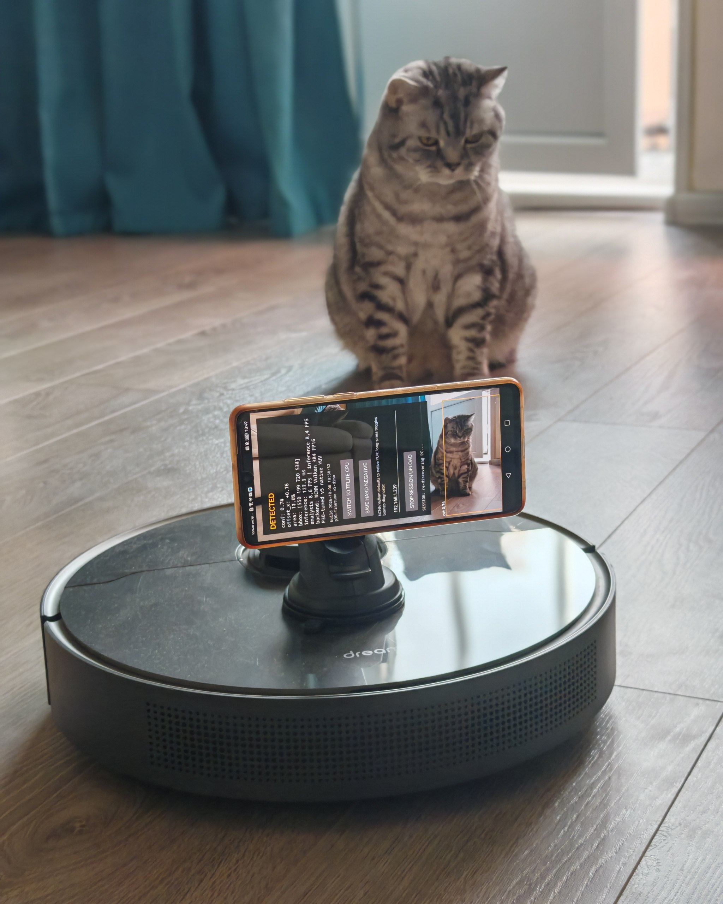
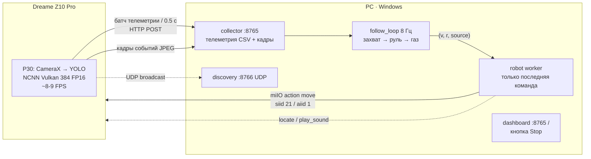
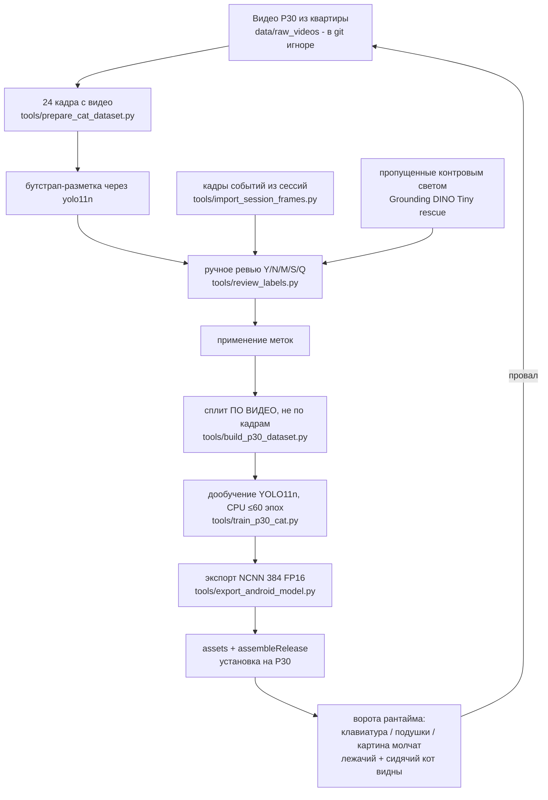
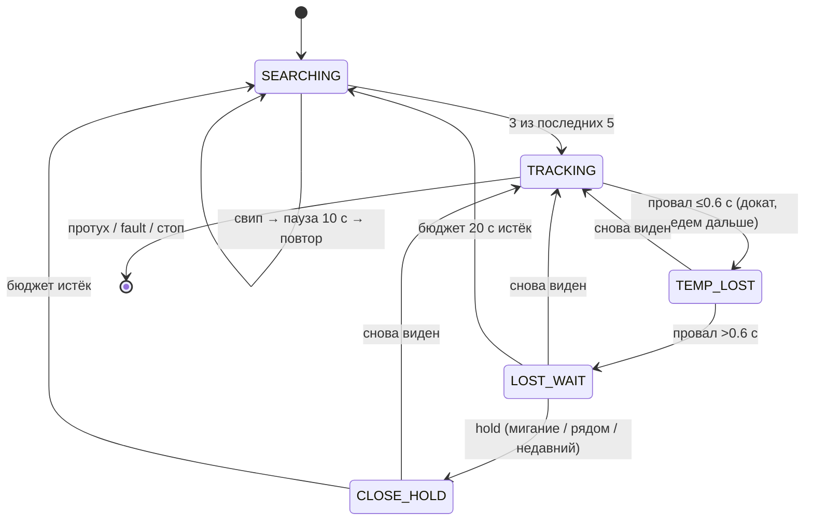

# Cat Stalker

Экспериментальный pet-проект: робот-пылесос **Dreame Z10 Pro** везёт на
себе камеру телефона, детектирует настоящего кота бортовым YOLO, держит
его в центре кадра и медленно следует за ним — рядом всегда человек и
кнопка останова.

Статус: рабочий прототип в активной настройке (октябрь 2026). Робот
находит, центрирует и догоняет спокойного сидящего кота; ходячий кот
пока перегоняет скорость поворота. Не продукт; небезопасно у лестниц,
проводов и других питомцев.

- [English](README.md) · Русский (этот файл)



## Содержание

- [Идея](#идея)
- [Железо](#железо)
- [Режимы работы](#режимы-работы)
- [Архитектура системы](#архитектура-системы)
- [Приложение и детектор](#приложение-и-детектор)
- [Конвейер обучения](#конвейер-обучения)
- [Запуск сессии](#запуск-сессии)
- [Логика следования](#логика-следования)
- [Управление Dreame](#управление-dreame)
- [Безопасность](#безопасность)
- [Репозиторий и документы](#репозиторий-и-документы)
- [Git-политика](#git-политика)

Заметки для агентов с точными константами и датированными находками:
[AGENTS.md](AGENTS.md) (на английском) — читать перед изменением
motion-кода.

## Идея

Пылесос уже умеет ездить, телефон уже умеет видеть. Cat Stalker
соединяет их: телефон смотрит, PC думает, робот едет. Детекция целиком
бортовая (без облака); на PC уходят только строки телеметрии и редкие
кадры событий, решение о движении — 8 Гц, роботу отправляется только
последняя команда `(velocity, rotation)`. Протухшие команды никогда не
копятся. Когда зрение неуверенно — робот стоит. Вслепую не едет никогда.

## Железо

| Компонент | Детали |
|---|---|
| Робот | Dreame Z10 Pro, `dreame.vacuum.p2028`, fw `4.1.8_1156`, LAN `192.168.1.124` |
| Камера | Huawei P30 на роботе, **только горизонтально**. Вертикальная установка не верифицирована: ось руления валидирована для горизонтали (однажды вертикальный телефон заставил робота рулить по *высоте* кота — см. `AGENTS.md`) |
| Эталонная камера | USB-камера на PC (эпоха прототипа) |
| Ручное управление | Xbox-геймпад (скрипт прототипа) |

## Режимы работы

| Режим | Код | Видит | Думает | Едет |
|---|---|---|---|---|
| Прототип (эталон) | `cat_stalker.py` (Windows) | USB-камера, COCO YOLO + ByteTrack | тот же PC | Dreame по miIO, Xbox-override |
| Автономная сессия | `android/` + `session/` | P30, свой `p30_cat_v5` NCNN | P30 детектирует, PC решает | Dreame по miIO, без Xbox |

Прототип доказал математику движения (V1.5 точно центрировал, V1.6
добавил подход). Стек сессий портирует её на поток с телефона и
добавляет zero-touch: запустил оба конца и ушёл; робот отчитывается
звуками динамика.

## Архитектура системы



Независимые циклы и их частоты:

| Цикл | Частота | Работа |
|---|---|---|
| `ImageAnalysis` телефона | ~8–9 FPS, `KEEP_ONLY_LATEST` | детект, буфер ≤2000 строк + ~100 МБ JPEG, выгрузка |
| Collector HTTP | по прибытии | пишет `phone_telemetry.csv`, `frames/`, heartbeat'ы |
| `follow_loop` | 8 Гц | захват цели, руль, газ, эпизоды поиска |
| Robot worker | 8 Гц в движении / 1.5 Гц keepalive в простое | шлёт последний `move`, меряет RTT, считает failures |
| Главный watchdog | 1 Гц | длительность, диск, тишина телефона, интерлок fault'ов, `STATUS.md` |

Детали: [session/README.md](session/README.md),
[android/README.md](android/README.md).

## Приложение и детектор

Два рантайма с переключением в приложении: **NCNN Vulkan 384 FP16 +
native YUV** (активный, ~100–130 мс, ~8–9 FPS sustained) и **TFLite CPU
480** (базовая проверка корректности). GPU-делегат TFLite на
Mali/Android 10 P30 не грузится. Native YUV отдаёт сенсорный буфер
прямо в NCNN (билинейно); bitmap-путь — для захватов и fallback'а.

Замеренные на P30 точки (полная таблица —
[android/README.md](android/README.md)): 320/352 отклонены (теряют кота
уже на ~3.5 м), 480 FP16 отклонён (~6 FPS и всё равно ненадёжен на 4 м+),
**384 FP16 принят** — лучший компромисс recall/FPS.

Эволюция детектора (полная история с метриками:
[data/p30_cat_training_results.md](data/p30_cat_training_results.md)):

| Модель | Val P / R | Судьба |
|---|---|---|
| COCO `yolo11n` | 0.20 / 0.35 | бейзлайн; срабатывает на принт, клавиатуру, картину |
| v1 (кадры квартиры) | 0.959 / 0.959 | отклонена на P30: шторм ложняков по серой подушке/клавиатуре |
| v2 (+hard negatives) | 0.920 / 0.934 | отклонена: не видела живого кота (виноват nearest-neighbor ресайз, починен билинейным) |
| v3 (сбалансированные негативы) | 0.932 / 0.918 | отклонена: клавиатура 0.6–0.8 |
| v4 (+точные сцены ошибок ×4) | 0.951 / 0.898 | вытеснена: просел recall |
| **v5 (+18 DINO-дотянутых контровым светом)** | **0.937 / 0.939** | **живая на телефоне**: ворота чистые (картина/подушки/клавиатура молчат, лежачий кот виден) |

Известный остаток: v5 всё ещё срабатывает на **принт кота вблизи /
под низким углом**. Та сессия помечена `NOT_FOR_TRAINING` (только hard
negatives) — перед любым переобучением проверять маркеры.

## Конвейер обучения



Правила, которые важны (полный воркфлоу:
[data/DATASET_WORKFLOW.md](data/DATASET_WORKFLOW.md)):

- Ревью через `tools/review_labels.py --dir <name>` (принимает
  RU-раскладку). Боксы tight, принты/отражения удалять, пустые кадры
  без кота — валидные негативы.
- **Сплит по исходному видео, никогда по кадрам** — иначе валидация врёт.
- Переобучение:
  ```powershell
  .\.venv\Scripts\python.exe tools\build_p30_dataset.py
  .\.venv\Scripts\python.exe tools\train_p30_cat.py
  ```
- Фиксы порогом запрещены: сложные true и false случаи пересекаются на
  conf 0.3–0.5. Лечить данными, не порогом.
- `tools/test_follow_hold.py` проверяет hold/sweep логику follow-цикла
  без робота.

## Запуск сессии

Нужно: `.venv` с
`pip install "git+https://github.com/rytilahti/python-miio.git"`,
`DREAME_TOKEN` в env (никогда в коде), телефон и PC в одном Wi-Fi,
в Windows Firewall открыты TCP `:8765` и UDP `:8766`.

```powershell
python -m session.auto_session --mode follow --duration-min 5
# --mode observe | patrol | follow ; без токена всё observe-only
```

Zero-touch: стартовать команду на PC (напечатает `phone_url`),
поставить телефон **горизонтально** низко спереди (не закрывать лидар
и датчики перепада), робот >1 м от стен/дока, запустить приложение —
оно само найдёт коллектор и постримит. Смотреть
`http://<ip-pc>:8765/` или `sessions/<stamp>/STATUS.md`.

Словарь динамика: `locate` = подойди, `play_sound` ×1 = готово,
×2 = ошибка. Каждый прогон пишет `sessions/<stamp>/`:
`phone_telemetry.csv`, `robot_telemetry.csv`, `robot_status.csv`,
`frames/`, `events.jsonl`, `STATUS.md`; `session/analyze.py` добавляет
`ANALYSIS.md`.

Останов: кнопка Stop в телефоне, Ctrl+C на PC (безопасный стоп `(0,0)` +
`stop_clean`), Stop на дашборде, или поднять робота. Watchdog'и: тишина
телефона 15 с hold / 60 с стоп, failures робота ≥5 стоп, диск <1 ГБ стоп,
конец длительности. Полная политика: [session/README.md](session/README.md).

## Логика следования

Захват: 3 из 5 кадров (подряд почти никогда не срабатывает на
мигающем детекторе телефона) → `TRACKING` с EMA-сглаживанием
(позиция 0.60 / размер 0.25) → `TEMP_LOST` (докат ≤0.6 с по
замороженной цели) → `LOST_WAIT` (hold: минимум 1.5 с, дольше если цель
видели <6 с назад или она рядом) → свип-эпизоды в одну сторону (бюджет
20 с, сначала в сторону ухода, иначе продолжение для покрытия 360°+) →
giveup + пауза-прослушивание 10 с → повтор. Протухшие кадры (>0.5 с) и
device fault — всегда стоп; fault ещё и сбрасывает захват, чтобы
перенесённый робот перезахватил заново.



Текущая настройка (06.10.2026, всё в `session/follow.py` /
`session/auto_session.py`):

| Параметр | Значение | Почему |
|---|---|---|
| Руль П+Д, мёртвая зона | KP 24 / KD 3, ±0.05–0.10 | портировано из прототипа V1.5 |
| Поворот мин / макс | 10 / 22 | <10 сидит в deadzone прошивки (доказано 75 с frozen offset); 22 — значение прототипа, ходячего кота всё равно не догоняет |
| Крейсер макс | 40 | 2× дважды по просьбе оператора; масштабирование от доворота держит повороты медленными |
| Площадь старт/стоп | 0.095 / 0.135 | НЕ КАЛИБРОВАНО под низкую камеру |
| Ворота offset | 0.65 | 0.13 блокировал вообще всю езду (кот жил на 0.58) |
| Conf старт/стоп | 0.32 / 0.25 | гистерезис против провалов вблизи |
| Slew за цикл 8 Гц | 5 rot / 8 vel | ~0.5 с полный размах; стопы/холды напрямую |
| Гувернёр скорости | fps/8, пол 0.4 | не обгонять свежие кадры |

## Управление Dreame

| Действие | siid / aiid | Использование |
|---|---|---|
| `move` | 21 / 1 | piid 1 = поворот, piid 2 = скорость |
| `locate` | 7 / 1 | сигнал внимания |
| `play_sound` | 7 / 2 | ×1 готово, ×2 ошибка |
| `start_clean` / `stop_clean` | 4 / 1, 2 | разборка сессии |
| `home` | 3 / 1 | |

Ручной режим всегда крутит мотор пылесоса (`set_fan_speed(0)` → Quiet).
Z10 Pro агрессивно спит по Wi-Fi в простое (секундные буферизованные
пинги), поэтому воркер шлёт keepalive `move(0,0)` — 1.5 Гц в простое,
8 Гц в движении. Read-only heartbeat его **не** будит.

## Безопасность

- Маленькая комната, без проводов на полу, человек рядом, пылесборник пуст.
- Скорости — стартовая точка, не проверенный предел; поднимать только
  после стабильного прогона по спокойному сидящему коту; подход сторожит
  `STOP_AREA`, после каждого поднятия скорости смотреть перелёт.
- Вперёд-вниз софт не видит обрывов — интерлок по fault'у срабатывает
  постфактум. Не гонять у лестниц и краёв столов (один cliff уже пойман
  в телеметрии).
- Автономного заднего хода нет. `DREAME_TOKEN` только из env.

## Репозиторий и документы

| Путь | Содержимое |
|---|---|
| `cat_stalker.py` | Прототип Windows (эталон — Xbox + камера) |
| `android/` | Приложение P30 (Kotlin + CameraX, NCNN Vulkan native YUV) — [android/README.md](android/README.md) |
| `session/` | Оркестратор PC (коллектор, follow, линк робота, discovery) — [session/README.md](session/README.md) |
| `sessions/` | записанные прогоны (в git игноре) |
| `tools/` | скрипты датасета / обучения / ревью / тестов |
| `data/` | кадры, разметка, результаты обучения (балк в игноре) — [data/DATASET_WORKFLOW.md](data/DATASET_WORKFLOW.md), [data/p30_cat_training_results.md](data/p30_cat_training_results.md) |
| `AGENTS.md` | заметки агентам: точные константы, датированные находки |